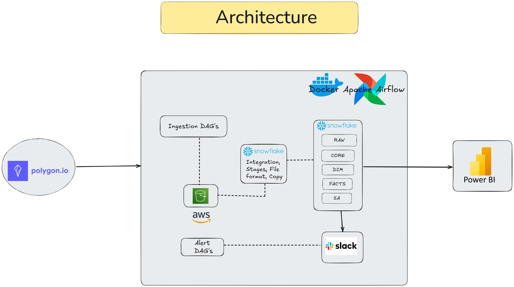
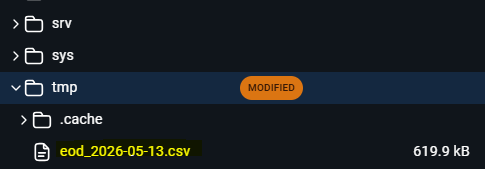
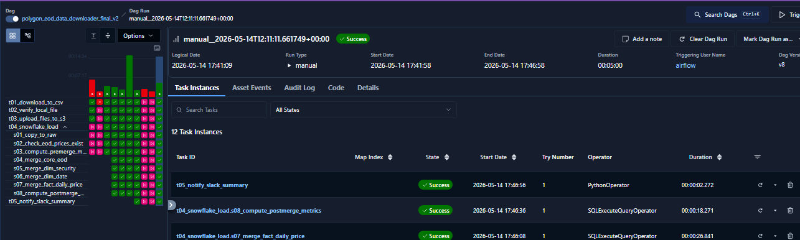
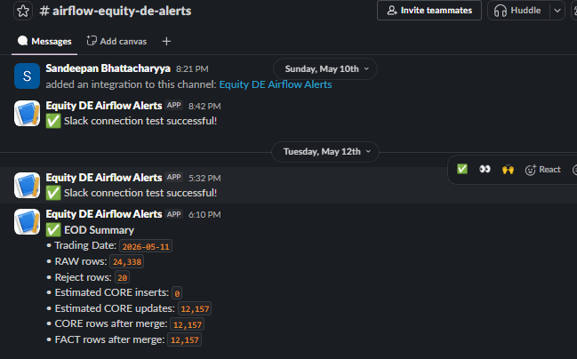
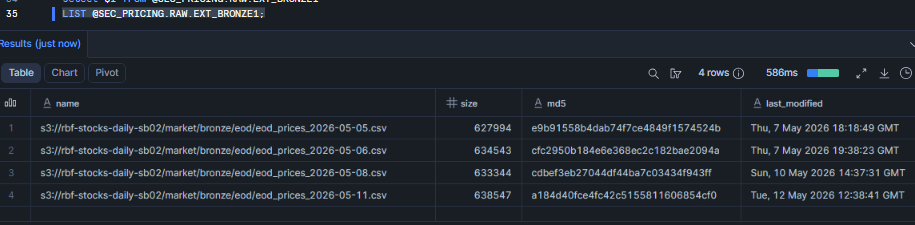
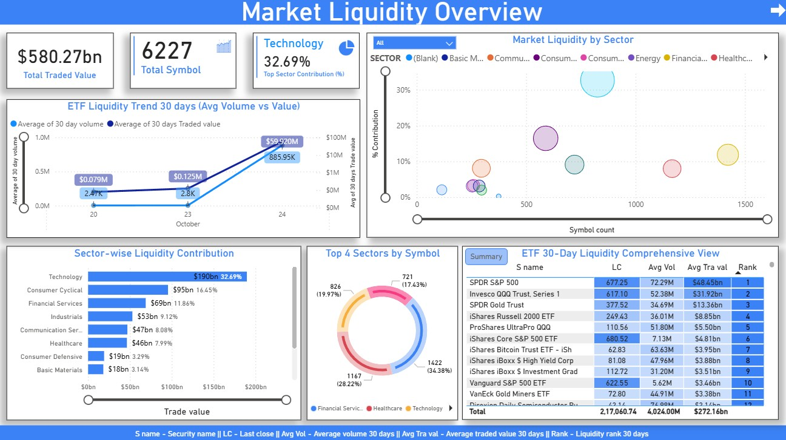
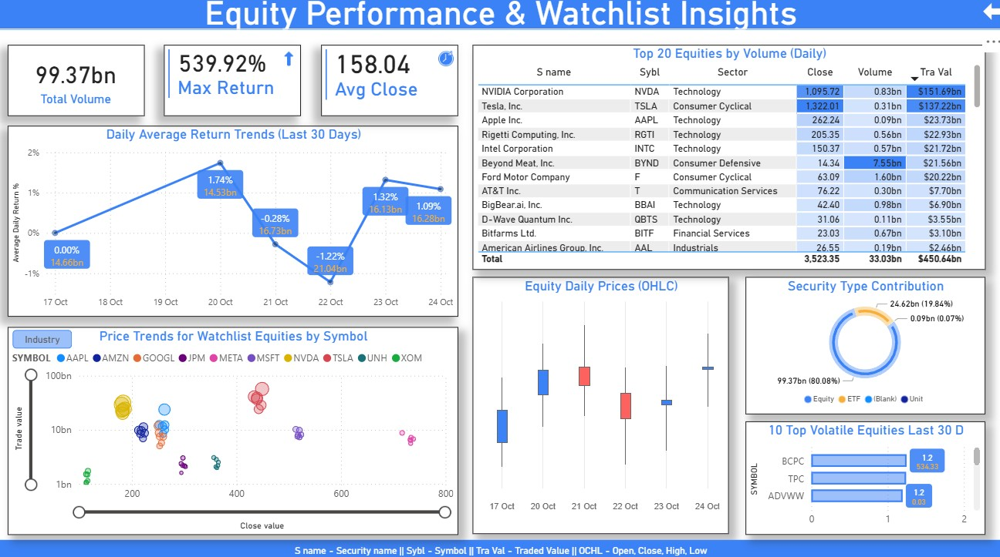

# EOD Securities Pricing Analytics Pipeline

1. **End-to-End Batch Data Engineering Project** — Polygon.io → AWS S3 → Snowflake → Power BI
2. Orchestrated with Apache Airflow on Docker
3. Configured Alerts via Slack

---

## Table of Contents


---

## Overview

**RBF**, a global investment firm, required a fully automated daily batch analytics platform to replace manual CSV collection and ad-hoc reporting. Analysts previously stitched together pricing data by hand delaying portfolio reviews, overnight risk adjustments, and sector monitoring.

This project delivers:

- **Automated EOD ingestion** of all U.S. equities and ETFs via the Polygon.io Grouped Daily Bars API
- **Multi-layer Snowflake data warehouse** (RAW → CORE → DM_DIM/DM_FACT → SA)
- **Data quality enforcement** with a reject table capturing invalid records (e.g. negative volumes) -- to allow Error Handling
- **Delta freshness checks** to ensure no stale data reaches analytics
- **Slack alerting** for pipeline failures and daily EOD load summaries
- **Power BI dashboards** serving 6 curated analytic views for trading, risk, and research teams

---

## Architecture

```
┌─────────────────────────────────────────────────────────────────────────────┐
│                        Docker + Apache Airflow                              │
│                                                                             │
│  polygon.io ──► Ingestion DAG ──► AWS S3 ──► Snowflake External Stage      │
│                      │                            │                        │
│                      │              ┌─────────────▼─────────────┐         │
│                      │              │     RAW   (append-only)    │         │
│                      │              │     CORE  (cleansed/merged)│         │
│                      │              │     DM_DIM (dimensions)    │         │
│                      │              │     DM_FACT (fact table)   │         │
│                      │              │     SA    (report views)   │         │
│                      │              └─────────────┬─────────────┘         │
│                 Alert DAGs ◄─────── Slack ◄────────┘                       │
└──────────────────────────────────────────────────────────────────┬──────────┘
                                                                   │
                                                              Power BI
```



---

## Tech Stack

| Layer | Technology |
|---|---|
| Data Source | [Polygon.io](https://polygon.io) Grouped Daily Bars API |
| Orchestration | Apache Airflow |
| Containerization | Docker + Docker Compose |
| Cloud Storage | AWS S3 (bronze landing zone) |
| Data Warehouse | Snowflake (multi-layer ELT) |
| Alerting | Slack Incoming Webhooks |
| Visualization | Microsoft Power BI |
| Language | Python, SQL |

---

## Project Structure

```
eod-securities-pipeline/
│
├── airflow/
│   └── dags/
│       ├── eod_ingestion_dag.py          # Main EOD ingestion DAG (8-task pipeline)
│       ├── etl_pipeline_template.py      # Generic ETL pattern template
│       └── helpers/
│           ├── polygon_eod_data_downloader.py  # Polygon API client + lookback logic
│           ├── slack_utils.py                  # Slack webhook helpers + failure callback
│           ├── test_airflow_aws_connection.py  # AWS connectivity smoke test
│           ├── test_slack_conn.py              # Slack connectivity smoke test
│           └── test_snowflake_aws_connection.py # Snowflake→S3 stage smoke test
│
├── snowflake/
│   ├── 01_setup/
│   │   └── initialize Warehouse, DB, schemas, all tables
│   ├── 02_raw_to_core/
│   │   └── Load from Raw layer to Core. Deduplication + MERGE into CORE with window functions
│   ├── 03_dimensions/
│   │   └── MERGE into DIM_SECURITY + DIM_DATE
│   ├── 04_facts/
│   │   └── MERGE into FACT_DAILY_PRICE
│   ├── 05_sa_layer/
│   │   └── This has the reporting views (analytics serving layer)
│   └── 06_reject/
│       └── Error Handling - Reject table
```

---

## Data Flow

### Step-by-Step Pipeline

```
[1] Download CSV          
    Polygon Grouped       Lookback up to N days to find last valid
    Daily Bars API   ───► trading day. Writes /tmp/eod_YYYY-MM-DD.csv in docker
         │
[2] Verify Local File     verify_file_exists()
    Check file exists     Raises AirflowFailException if missing
    + log size       ───►
         │
[3] Upload to S3          LocalFilesystemToS3Operator
    Keyed as:             market/bronze/eod/eod_prices_YYYY-MM-DD.csv
    market/bronze/eod/────►
         │
[4] Snowflake Load (TaskGroup: t04_snowflake_load)
    │
    ├─ s01: COPY INTO RAW         External stage → RAW.RAW_EOD_PRICES
    ├─ s02: Check loaded          SnowflakeCheckOperator (delta freshness)
    ├─ s03: Pre-merge metrics     Count RAW rows, rejects, insert/update estimates
    ├─ s04: MERGE → CORE          Dedup via ROW_NUMBER(), reject negatives to REJECT table
    ├─ s05: MERGE → DIM_SECURITY  Upsert new symbols (parallel with s06)
    ├─ s06: MERGE → DIM_DATE      Upsert new calendar dates (parallel with s05)
    ├─ s07: MERGE → FACT          Join CORE × DIM_SECURITY × DIM_DATE
    └─ s08: Post-merge metrics    Count CORE and FACT rows for Slack summary
         │
[5] Slack Summary         notify_slack_summary()
    Posts trading date,   trigger_rule=all_done (fires even on partial failure)
    row counts, rejects ──►
```



### Dependency Graph

```
t01_download → t02_verify → t03_upload_s3
                                  │
                            t04_snowflake_load
                            │
                    s01_copy_raw → s02_check → s03_pre_metrics → s04_merge_core
                                                                       │
                                                          ┌────────────┴────────────┐
                                                    s05_dim_security         s06_dim_date
                                                          └────────────┬────────────┘
                                                                 s07_merge_fact
                                                                       │
                                                                s08_post_metrics
                                                                       │
                                                               t05_slack_summary
```

---

## Snowflake Schema Design

### Layer Architecture

```
SEC_PRICING database
│
├── RAW schema             ← Append-only landing. Never mutated.
│   └── RAW_EOD_PRICES         Source of truth; includes _SRC_FILE + _INGEST_TS audit cols
│
├── CORE schema            ← Cleansed, deduplicated, validated canonical records
│   ├── EOD_PRICES             MERGE target; ROW_NUMBER() dedup on (TRADE_DATE, SYMBOL)
│   └── EOD_PRICES_REJECT      Quarantine for invalid records (e.g. VOLUME < 0)
│
├── DM_DIM schema          ← Conformed dimensions
│   ├── DIM_SECURITY           Surrogate key via SEQUENCE; SYMBOL UNIQUE constraint
│   ├── DIM_DATE               DATE_SK = YYYYMMDD integer; full calendar attributes
│   └── DIM_SECURITY_ATTRIBUTES  Enrichment layer: name, type, sector, industry, URL
│
├── DM_FACT schema         ← Fact table at (SECURITY_ID, DATE_SK) grain
│   └── FACT_DAILY_PRICE        FK to both dims; composite PK prevents duplicates
│
└── SA schema              ← Serving/analytics layer (views only, no stored data)
    ├── VW_SECURITY_DAILY_PRICES         Base enriched view (joins all 4 tables)
    ├── VW_TOP20_EQUITY_BY_VOLUME_DAILY  Daily top 20 equities ranked by volume
    ├── VW_WATCHLIST_HISTORY             10 pre-defined watchlist stocks full history
    ├── VW_SECURITY_LAST_30D_DAILY_RETURN  Daily % returns with LAG() window function
    ├── VW_SECTOR_LIQUIDITY_LATEST       Sector traded value + % contribution (latest day)
    └── VW_ETF_LIQUIDITY_30D_SUMMARY     30-day rolling avg volume/value per ETF
```

### Key Design Decisions

| Decision | Rationale |
|---|---|
| RAW is append-only | Preserves full audit trail; re-processing safe |
| CORE uses MERGE (not INSERT) | Idempotent; handles late-arriving / reprocessed files |
| SEQUENCE for SECURITY_ID | Avoids identity column race conditions in concurrent loads |
| Reject table in CORE schema | Invalid rows never reach dimensions/facts but are traceable |
| DATE_SK as YYYYMMDD integer | Fast integer joins; human-readable without conversion |
| SA layer = views only | Zero storage cost; always reflects latest FACT state |

---

## Airflow DAGs

### Main Production DAG

| Config | Value |
|---|---|
| Schedule | `5 21 * * 1-5` (Mon–Fri 21:05 UTC ≈ after 4PM NYSE close) |
| Catchup | `False` |
| Max Active Runs | `1` |
| Retries | `3` with 5-minute delay |
| Failure Callback | `on_task_failure()` → Slack alert |

**Airflow Variables required:**

| Variable | Description |
|---|---|
| `POLYGON_API_KEY` | Polygon.io API key |
| `LOOKBACK_DAYS` | Days to search back for last valid trading day (default: `10`) |
| `S3_BUCKET` | Target S3 bucket name |

**Airflow Connections required:**

| Connection ID | Type |
|---|---|
| `aws_default` | Amazon Web Services |
| `snowflake_default` | Snowflake |
| `slack_default` | HTTP (Slack Incoming Webhook) |



### Slack Notifications

Two types of notifications fire automatically:

1. **Task Failure Alert** — fires on any task failure via `on_task_failure` callback
2. **EOD Summary** — fires at pipeline end (even on partial failure) with:
   - Trading date processed
   - RAW row count + reject count
   - Estimated CORE inserts/updates
   - Final CORE and FACT row counts



---

## SA Layer (Reporting Views)

All 6 views are built on top of `VW_SECURITY_DAILY_PRICES` (the enriched base view joining FACT + both DIM tables + attributes).

| View | Description | Key Technique |
|---|---|---|
| `VW_SECURITY_DAILY_PRICES` | Base view — all securities with enrichment | 4-table JOIN |
| `VW_TOP20_EQUITY_BY_VOLUME_DAILY` | Daily top 20 equities by volume | `ROW_NUMBER() + QUALIFY` |
| `VW_WATCHLIST_HISTORY` | Full history for 10 curated watchlist stocks | CTE with inline VALUES |
| `VW_SECURITY_LAST_30D_DAILY_RETURN` | Daily % return (last 30 days, prior close) | `LAG()` window function |
| `VW_SECTOR_LIQUIDITY_LATEST` | Sector traded-value + % of market (latest day) | Multi-CTE aggregation |
| `VW_ETF_LIQUIDITY_30D_SUMMARY` | 30-day rolling avg volume/value per ETF | `AVG() OVER ... ROWS BETWEEN 29 PRECEDING` |

---

## Engineering Challenges & Solutions

### 1. Snowflake External Stage to S3

Setting up the external stage produced an `sts:AssumeRole` authorization error
even with a correctly configured IAM trust policy. The root cause was three
separate AWS account-level issues stacked in sequence — each one hiding behind
the previous fix:

- **Missing cross-account S3 bucket policy** — Snowflake's IAM user lives in a
  different AWS account than the IAM role. S3 evaluates both sides independently,
  so the bucket itself requires an explicit policy granting the role access.
  The role's own permissions are not sufficient for cross-account access.

- **ap-southeast-7 (Thailand) region not opted in** — this is a newer AWS opt-in
  region. The AWS account had never enabled it, so STS was silently rejecting
  `AssumeRole` requests at the account level before IAM was even evaluated.

- **STS regional endpoint not activated** — opting into a region does not
  automatically activate its STS endpoint. AWS requires this to be toggled on
  separately under IAM → Account Settings → Security Token Service. Without it,
  `AssumeRole` fails even with a correct trust policy and an opted-in region.

The error message (`not authorized to perform sts:AssumeRole`) pointed directly
at IAM — but IAM was never the problem. Full resolution steps and the exact
bucket policy used are documented in
==> [`SNOWFLAKE_S3_TROUBLESHOOTING.md`](SNOWFLAKE_S3_TROUBLESHOOTING.md).



### 2. Window Functions in MERGE Source

The RAW → CORE merge uses `ROW_NUMBER() OVER (PARTITION BY TRADE_DATE, SYMBOL ORDER BY _INGEST_TS DESC)` inside the USING clause to deduplicate before merging. Snowflake does not allow window functions directly in a MERGE's USING subquery at certain nesting levels — this was resolved by wrapping the ranked CTE in an additional subquery so the `WHERE row_number_val = 1` filter operates on a materialized rowset.

### 3. Reject Table for Invalid Records

Rather than failing the entire load on bad data, records with `VOLUME < 0` (or other data quality violations) are routed to `CORE.EOD_PRICES_REJECT` with a `REJECT_REASON` column and `REJECT_TS` audit timestamp. This is implemented in the MERGE's `WHEN NOT MATCHED` branch via a conditional INSERT, allowing the pipeline to complete successfully while making rejected rows fully auditable and re-processable.

### 4. Pandas in Dockerized Airflow

The official `apache/airflow` Docker image does not include `pandas` by default. The solution was to extend the base image via a custom `Dockerfile` (referenced in `docker-compose.yaml` via `build: .`) with `_PIP_ADDITIONAL_REQUIREMENTS` for quick iteration, and a proper `Dockerfile` with `pip install pandas` for production. The `docker-compose.yaml` is configured to build the custom image rather than pull the stock one, ensuring pandas and other custom dependencies are available across all worker containers.

---

## Setup & Deployment

### Prerequisites

- Docker Desktop (or Docker Engine + Compose plugin)
- Snowflake account (free trial works)
- AWS account with an S3 bucket
- Polygon.io API key (free Starter tier sufficient for grouped daily)
- Slack workspace with Incoming Webhooks app enabled
-------------------
-------------------

# Code Highlights

Two pieces of code from this project that demonstrate real engineering depth —
not boilerplate, not tutorial code. Both solved actual production problems.

---

## 1. Airflow — Dynamic XCom-Keyed S3 Upload + Parallel Dimension Load + Resilient Slack Summary

This section of the DAG shows three things working together:

- **XCom-driven dynamic filenames** — the trading date resolved by the Polygon
  lookback is pushed to XCom in task `t01`, then pulled via Jinja templating
  directly inside the `LocalFilesystemToS3Operator` fields at execution time.
  This means the correct file is always uploaded even when the lookback resolves
  to a date other than today (e.g. Monday's run picking up Friday's data).

- **Parallel dimension loading inside a TaskGroup** — `DIM_SECURITY` and
  `DIM_DATE` have no dependency on each other, both sourcing from the already-merged
  CORE layer. Expressing them as `[merge_dim_security, merge_dim_date]` in the
  dependency chain halves the wall-clock time for the dimension phase.

- **`trigger_rule="all_done"` on the Slack summary** — the default `"all_success"`
  would silence the alert if any upstream task failed or was skipped. `"all_done"`
  guarantees the summary always fires, giving the on-call engineer immediate
  visibility into what loaded and what didn't — without needing to open the
  Airflow UI.

```python
# ── Upload to S3 with XCom-templated filename and key ──────────────────────
upload_files_to_s3 = LocalFilesystemToS3Operator(
    task_id="t03_upload_files_to_s3",
    filename=(
        "/tmp/eod_"
        "{{ti.xcom_pull(task_ids='t01_download_to_csv', key='trading_date')}}"
        ".csv"
    ),
    dest_bucket=S3_BUCKET,
    dest_key=(
        "market/bronze/eod/"
        "eod_prices_{{ ti.xcom_pull(task_ids='t01_download_to_csv', key='trading_date') }}.csv"
    ),
    aws_conn_id="aws_default",
    replace=True,
)

# ── Snowflake TaskGroup: sequential within, parallel where safe ─────────────
with TaskGroup(group_id="t04_snowflake_load") as snowflake_load:

    copy_to_raw      = SQLExecuteQueryOperator(task_id="s01_copy_to_raw",          ...)
    check_loaded     = SnowflakeCheckOperator(task_id="s02_check_eod_prices_exist", ...)
    premerge_metrics = SQLExecuteQueryOperator(task_id="s03_compute_premerge_metrics", ...)
    merge_core       = SQLExecuteQueryOperator(task_id="s04_merge_core_eod",        ...)
    merge_dim_security = SQLExecuteQueryOperator(task_id="s05_merge_dim_security",  ...)
    merge_dim_date     = SQLExecuteQueryOperator(task_id="s06_merge_dim_date",      ...)
    merge_fact       = SQLExecuteQueryOperator(task_id="s07_merge_fact_daily_price", ...)
    postmerge        = SQLExecuteQueryOperator(task_id="s08_compute_postmerge_metrics", ...)

    copy_to_raw >> check_loaded >> premerge_metrics >> merge_core
    #                                                      │
    merge_core >> [merge_dim_security, merge_dim_date] >> merge_fact >> postmerge
    #              └── both dims load in parallel ──┘

# ── Main pipeline chain ─────────────────────────────────────────────────────
download >> verify_file >> upload_files_to_s3 >> snowflake_load

# ── Slack summary fires regardless of upstream success/failure ──────────────
slack_summary = PythonOperator(
    task_id="t05_notify_slack_summary",
    python_callable=notify_slack_summary,
    trigger_rule="all_done",   # <── fires even if an upstream task failed/skipped
)

snowflake_load >> slack_summary
```

**Why this matters:**
> "I didn't just chain tasks sequentially. I identified that the two dimension
> loads had no dependency on each other and parallelized them. I also made the
> Slack alert unconditional — because a silent failure at 9 PM is worse than a
> noisy one."

---

## 2. SQL — RAW → CORE MERGE with CTE-Wrapped Deduplication + Reject Routing

**File:** `snowflake/02_raw_to_core/raw_to_core_merge.sql`

This is the core ELT transformation. It solves three problems at once:

- **Idempotent upsert** — using `MERGE` instead of `INSERT` means re-running
  the pipeline on the same date (e.g. after a data fix or file re-drop) will
  update existing rows rather than duplicate them. The pipeline is safe to
  re-trigger without manual cleanup.

- **Deduplication via CTE-wrapped window function** — if multiple files land
  for the same trading day (or the same file is re-processed), `ROW_NUMBER()
  OVER (PARTITION BY TRADE_DATE, SYMBOL ORDER BY _INGEST_TS DESC)` keeps only
  the most recently ingested record per `(date, symbol)` key. Snowflake raises
  a compilation error when window functions appear directly inside a `MERGE
  USING` subquery — wrapping in a named CTE resolves this cleanly.

- **Reject routing** — records with `VOLUME < 0` (data quality violations,
  tested with intentionally injected dummy rows) are never silently dropped
  or allowed into the clean layer. They are captured in `CORE.EOD_PRICES_REJECT`
  with a `REJECT_REASON` column, `_SRC_FILE` provenance, and `REJECT_TS`
  timestamp — fully auditable and re-processable.

```sql
MERGE INTO CORE.EOD_PRICES AS TGT
USING (
    -- CTE layer 1: normalize symbols (trim whitespace, uppercase)
    WITH raw_src_data AS (
        SELECT
            rw.TRADE_DATE,
            UPPER(TRIM(rw.SYMBOL))  AS SYMBOL,
            rw.OPEN, rw.HIGH, rw.LOW, rw.CLOSE, rw.VOLUME,
            rw._SRC_FILE, rw._INGEST_TS
        FROM RAW.RAW_EOD_PRICES rw
    ),
    -- CTE layer 2: deduplicate — keep latest ingest per (date, symbol)
    -- NOTE: window function is inside a named CTE to avoid Snowflake
    --       compilation error when using ROW_NUMBER() directly in MERGE USING
    ranked AS (
        SELECT
            *,
            ROW_NUMBER() OVER (
                PARTITION BY TRADE_DATE, SYMBOL
                ORDER BY _INGEST_TS DESC          -- latest file wins on re-ingest
            ) AS row_number_val
        FROM raw_src_data
        WHERE VOLUME >= 0                         -- exclude invalid rows before ranking
    )
    SELECT TRADE_DATE, SYMBOL, OPEN, HIGH, LOW, CLOSE, VOLUME
    FROM ranked
    WHERE row_number_val = 1                      -- one row per (date, symbol)

) AS SRC
ON  TGT.TRADE_DATE = SRC.TRADE_DATE
AND TGT.SYMBOL     = SRC.SYMBOL

WHEN MATCHED THEN
    UPDATE SET
        TGT.OPEN     = SRC.OPEN,
        TGT.HIGH     = SRC.HIGH,
        TGT.LOW      = SRC.LOW,
        TGT.CLOSE    = SRC.CLOSE,
        TGT.VOLUME   = SRC.VOLUME,
        TGT.LOAD_TS  = CURRENT_TIMESTAMP()

WHEN NOT MATCHED THEN
    INSERT (TRADE_DATE, SYMBOL, OPEN, HIGH, LOW, CLOSE, VOLUME, LOAD_TS)
    VALUES (SRC.TRADE_DATE, SRC.SYMBOL, SRC.OPEN, SRC.HIGH,
            SRC.LOW, SRC.CLOSE, SRC.VOLUME, CURRENT_TIMESTAMP());


-- ── Reject routing: invalid records quarantined with audit trail ─────────────
-- Runs after the MERGE. Captures rows excluded above (VOLUME < 0).
INSERT INTO CORE.EOD_PRICES_REJECT
    (TRADE_DATE, SYMBOL, OPEN, HIGH, LOW, CLOSE, VOLUME,
     REJECT_REASON, _SRC_FILE, _INGEST_TS)
SELECT
    TRADE_DATE, SYMBOL, OPEN, HIGH, LOW, CLOSE, VOLUME,
    'NEGATIVE_VOLUME'   AS REJECT_REASON,
    _SRC_FILE,
    _INGEST_TS
FROM RAW.RAW_EOD_PRICES
WHERE VOLUME < 0;
```

**Why this matters:**
> "The MERGE is idempotent — I can re-run it against the same date without
> creating duplicates. The CTE structure wasn't just style; Snowflake throws
> a compilation error if you try to use ROW_NUMBER() directly in the USING
> clause. And bad rows don't get silently dropped — they land in a reject table
> with a reason code, a source file reference, and a timestamp, so nothing is
> ever lost."

---

## Quick Reference — What Each Piece Demonstrates

| Skill | Evidence |
|---|---|
| Airflow DAG design | TaskGroup, XCom, Jinja templating, parallel tasks, trigger rules |
| Airflow operators | `PythonOperator`, `LocalFilesystemToS3Operator`, `SQLExecuteQueryOperator`, `SnowflakeCheckOperator` |
| Snowflake ELT | Multi-CTE MERGE, window functions, idempotent upsert pattern |
| Data quality | Reject table with audit trail, validation before transformation |
| Production thinking | Re-runnable pipelines, unconditional alerting, parallel load optimization |


## Final Analytics Deliverables (Power BI)

Connect Power BI to Snowflake using the `SA` schema views. All 6 views are designed to be imported directly as tables.
The Power BI dashboard is built on top of the SA layer, enabling direct access to clean, business-ready data for reporting and analysis.




### Key Analysis

- Technology dominates sector liquidity at **32.69% ($190bn)** — nearly double
  Consumer Cyclical at 16.45%, signaling concentrated market activity in a single sector.

- **SPDR S&P 500** ranks as the most liquid ETF with a 30-day average traded value
  of **$48.45bn**, with Invesco QQQ following at $31.92bn — together accounting for
  the bulk of ETF market activity.

- **NVIDIA leads** all equities by traded value at **$151.69bn** on a close of
  $1,095.72 — significantly ahead of Tesla at $137.22bn, reflecting outsized
  institutional interest in AI-driven semiconductors.

- Daily average return dropped to **-1.22% on Oct 22** before recovering to
  **+1.32% on Oct 23** — a sharp two-day swing that would trigger watchlist
  alerts and warrant overnight risk review.

-------------------------------------------------------------------
## Final Thoughts

This project was built to reflect how data engineering actually works —
not the happy path, but the full picture: infrastructure that doesn't
behave as documented, error messages that point in the wrong direction,
and data quality problems that need to be handled gracefully rather than
by failing loudly.

The three AWS issues behind the S3 stage, the Snowflake window function
compilation constraint, the reject table pattern, and getting pandas into
a Dockerized Airflow environment were all real blockers encountered and
resolved during development. They are documented here because that
troubleshooting process is as much a part of the engineering work as the
code itself.

If you are a recruiter or engineer reading this — 
The `SNOWFLAKE_S3_TROUBLESHOOTING.md` AND `HIGHLIGHTS.md` is worth a look beyond the README.
1. [`SNOWFLAKE_S3_TROUBLESHOOTING.md`](SNOWFLAKE_S3_TROUBLESHOOTING.md)
2. [`HIGHLIGHTS.md`](HIGHLIGHTS.md)

Feel free to ⭐ the repo if you found this useful!
